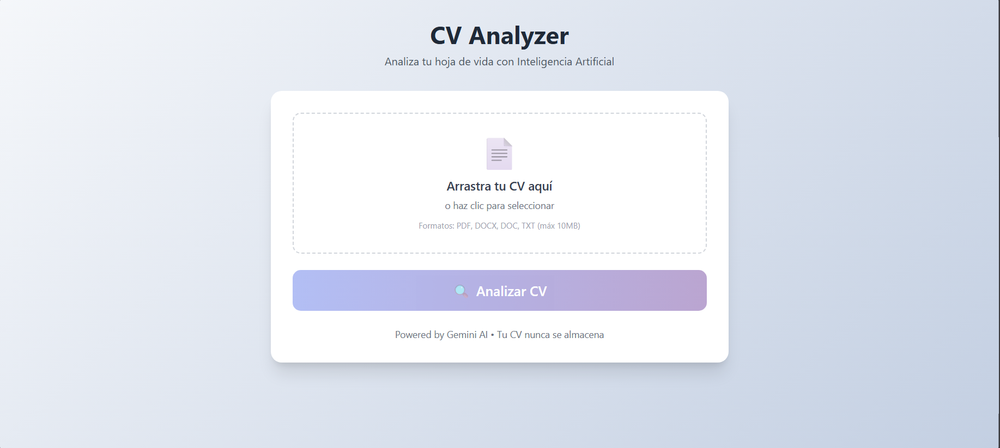

# CV Analyzer App


Analiza tu hoja de vida con Inteligencia Artificial. Sube tu CV (PDF/DOCX) y recibe un análisis completo con recomendaciones.

## Demo
🔗 [Ver aplicación](https://cv-analizer-8iurrlcnf-julian-andres-yepes-gomezs-projects.vercel.app/)

## Screenshot  ← aquí



## Funcionalidades

- Subir archivos PDF, DOCX, DOC o TXT
- Análisis automático con Groq AI
- Fortalezas, áreas a mejorar y recomendaciones

## Tech Stack

- **Frontend**: React + Vite + TailwindCSS
- **Backend**: Node.js + Express
- **AI**: Groq - Llama 3.3 70B (API gratuita)

## Configuración

### 1. Instalar dependencias

```bash
npm run install:all
```

### 2. Configurar variables de entorno

Edita `server/.env` con tu API key de Groq:

```env
PORT=3001
GROQ_API_KEY=tu_api_key_aqui
```

Obtén tu API key en: https://console.groq.com/keys

### 3. Ejecutar

```bash
npm run dev
```

## Uso

1. Abre http://localhost:5173
2. Arrastra o selecciona tu archivo CV
3. Click en "Analizar CV"
4. Revisa el análisis y recomendaciones

## Límites Gratuitos (Groq)

- **RPM**: 30 requests/minuto
- **TPM**: 6,000 tokens/minuto
- **RPD**: 14,400 requests/día
- **Velocidad**: 300-1000 tokens/segundo

Modelos disponibles: Llama 3.3 70B, Llama 3.1 8B, Qwen3 32B

## Estructura

```
cv-analyzer/
├── client/           # React frontend
│   └── src/
│       ├── components/
│       ├── services/
│       └── App.jsx
├── server/          # Express API
│   ├── controllers/
│   ├── services/
│   │   ├── extractor.js   # PDF/DOCX
│   │   └── ia.js     # Groq AI
│   └── routes/
└── package.json
```